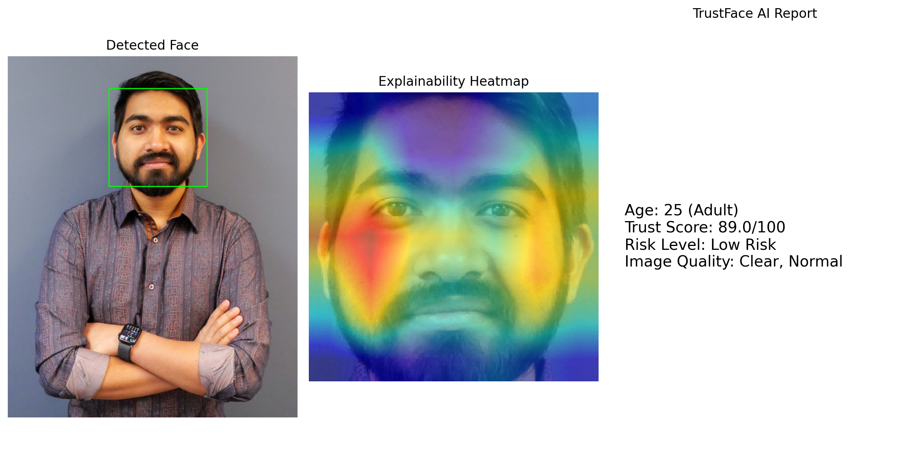
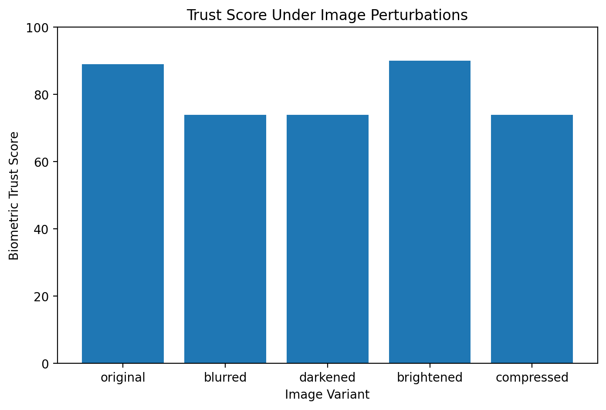

# TrustFace AI

TrustFace AI is a research-inspired prototype for trustworthy facial AI analysis. It analyzes facial images and generates a preliminary biometric trust score using facial attribute estimation, face detection confidence, and image quality checks.

## Motivation

Facial AI systems are increasingly used in identity verification, age estimation, and online safety applications. However, facial analytics can be affected by image quality, appearance changes, makeup, manipulation, and other real-world factors. This project explores how trust-aware analysis and interpretable outputs can support research in reliable facial AI systems.

## Current Features

- Facial age estimation
- Minor/adult age group flag
- Gender and emotion estimation
- Face detection confidence
- Image blur and brightness checks
- Biometric trust score
- Risk level assessment
- JSON result export
- Batch image analysis
- Face bounding box and eye marker visualization

## Research Context

This project is inspired by recent research on trustworthy biometric systems, facial manipulation robustness, image forensics, and age verification. It is intended only as a research prototype, not as a real-world identity or age verification system.

## Tech Stack

- Python
- DeepFace
- OpenCV
- FastAPI planned
- PyTorch
- Matplotlib

## Sample Report

## Perturbation Robustness Test

TrustFace AI also evaluates how image perturbations affect the biometric trust score.

Example tested perturbations:
- Original image
- Blurred image
- Darkened image
- Brightened image
- JPEG-compressed image

## Disclaimer

This system is for research and educational exploration only. It should not be used for real-world identity verification, age verification, law enforcement, or high-stakes decision making.